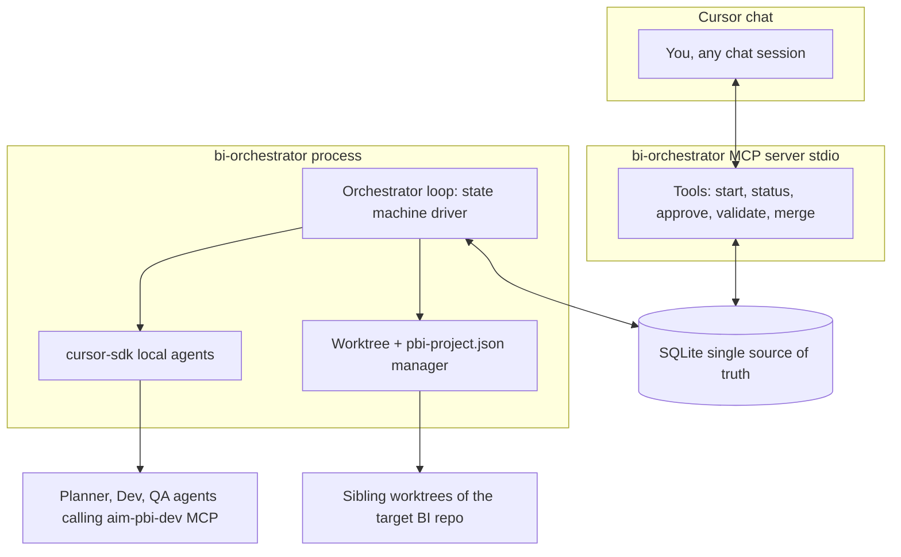

## What we are building

A long-running local Python service on the Windows machine, paired with a custom MCP server that exposes the service to any Cursor chat. The service owns the orchestration state machine; the MCP is a thin client that reads/writes the same SQLite store. Optional skills wrap the most common entry points in chat.

Three processes, one source of truth:



Why this shape: stdio MCP processes die when the chat ends, so the orchestrator cannot live inside the MCP. SQLite as the communication channel keeps both processes stateless toward each other, makes reboot recovery trivial, and gives us a free audit log.

## How you invoke it

The orchestrator does **not** intercept normal Cursor behavior. Day-to-day "add a measure, fix this DAX" work stays exactly as today. The orchestrator is a separate tool you reach for explicitly when the task is "batch of work, run in parallel autonomously."

- The MCP is installed at user level in `~/.cursor/mcp.json`, so its tools are visible in every chat but only do anything when you call them.
- A small `bi-orchestrator` skill at `~/.cursor/skills/bi-orchestrator/SKILL.md` keys on phrases like "kick off a pipeline", "run these requirements in parallel", "orchestrate this work" so the chat agent auto-discovers the workflow without you remembering tool signatures.
- The target repo is a **parameter** to every pipeline (`start_pipeline(requirements, target_repo_path, ...)`). Same orchestrator instance handles any number of Power BI workspaces under `Q:\BI\Users\Dudi\Developments\<repo>\` as long as each has the standard `.cursor/mcp.json` + `.cursor/skills/powerbi-dev/` + `pbi-project.json` + `qa/` shape. Cross-workspace pipelines run side by side safely because each has its own deploy targets and baselines.

## Tech stack

- Python (matches the BI ecosystem and the aim-pbi-dev MCPs)
- `cursor-sdk` for agent invocation, local runtime only — uses your existing `CURSOR_API_KEY`, same model catalog as Cursor chat, no separate LLM provider
- SQLite via stdlib `sqlite3` — no install, no service, single `state.db` file under `~/.bi-orchestrator/`
- `mcp` SDK or FastMCP for the MCP server
- `gh` CLI for PR operations (innersource auth already configured on your machine)
- `git worktree` for branch isolation

## Models

All agents run on Cursor's model backend through the SDK; no external Anthropic / OpenAI keys. Defaults are configured per role in `config.toml`:

```toml
[models]
planner = "opus-4.7"
developer = "opus-4.7"
qa = "opus-4.7"
```

`Cursor.models.list()` enumerates valid IDs for your account. `start_pipeline` accepts optional per-pipeline overrides (e.g. `{"planner": "auto", "qa": "<cheaper-model>"}`) for one-off tuning. Phase 0 verifies `opus-4.7` is in your model list before any agent launch; if the slug differs in your account we fall back to whatever the canonical Opus 4.7 ID is. Revisit per-role once we see which agent burns the most cost or produces the most rework.

## Repo layout

New project at `C:\Users\drippel\OneDrive - Intel Corporation\Documents\Technical\agents-orchestrator\` (the orchestrator code lives outside the corp share for speed; backed up via OneDrive). Worktrees of target BI repos still live on `Q:\` so MCP launcher paths in `.cursor/mcp.json` resolve.

- `bi_orchestrator/db.py` — SQLite schema + DAO
- `bi_orchestrator/state_machine.py` — assignment lifecycle, transitions, cap enforcement
- `bi_orchestrator/orchestrator.py` — main loop, agent launcher, reboot recovery
- `bi_orchestrator/worktree.py` — `git worktree add/remove`, per-branch `pbi-project.json` patching
- `bi_orchestrator/agents/{planner,developer,qa}.py` — agent invocation wrappers
- `bi_orchestrator/mcp_server.py` — FastMCP server, reads/writes SQLite only
- `bi_orchestrator/cli.py` — direct control without MCP
- `bi_orchestrator/notify.py` — writes notification rows the MCP surfaces
- `prompts/{planner,developer,qa}.md` — agent system prompts
- `migrations/0001_init.sql`
- `config.toml` — caps, paths, model selection, defaults
- `pyproject.toml`, `README.md`

Installed alongside (outside the project tree):

- `~/.cursor/mcp.json` — adds the orchestrator MCP server entry at user level
- `~/.cursor/skills/bi-orchestrator/SKILL.md` — ergonomic chat trigger for the workflow
- `~/.bi-orchestrator/state.db` — SQLite store (single file, no service)
- `~/.bi-orchestrator/logs/` — per-pipeline log files

## State machine

```text
planned -> awaiting_plan_approval -> approved
approved -> dev_running -> static_qa_running -> live_qa_running -> awaiting_validation
awaiting_validation -> validation_iteration -> dev_running   (loop, capped)
awaiting_validation -> merging -> done
any -> paused | cancelled | cap_exceeded | failed
```

Caps per assignment: `max_qa_iterations=3`, `max_validation_iterations=3`, `max_cost_usd=5`, `max_wallclock_minutes=120`. Per pipeline: `max_parallel_dev_agents=4`, `max_cost_usd=30`. Any cap breach pauses the assignment and writes a `notification` row.

## SQLite schema sketch

- `pipeline(id, created_at, status, requirements_doc, target_repo_path, cost_usd, ...)`
- `assignment(id, pipeline_id, title, branch, worktree_path, deploy_target_name, status, depends_on_json, files_json, dev_agent_id, dev_iter, qa_agent_id, qa_iter, validation_iter, pr_number, cost_usd, last_event_at, ...)`
- `scenario(id, assignment_id, name, kind, expected_json, last_actual_json, last_status)` (kind = `dax_assertion | schema_diff | aggregate_reconcile | visual_smoke | acceptance_criteria`)
- `event(id, assignment_id, ts, kind, payload_json)` — append-only audit log
- `notification(id, created_at, assignment_id, kind, message, acknowledged_at)`

On daemon start: `SELECT * FROM assignment WHERE status IN ('dev_running','static_qa_running','live_qa_running')` and call `Agent.resume(agent_id, ...)` for each.

## Agent design

- Planner agent: reads requirements, the target repo's structure, `CODEOWNERS`-style hints, recent git activity. Emits a JSON plan with assignments, file scopes, branch names, deploy-target names, dependency graph, and per-assignment acceptance scenarios. Single `Agent.prompt(...)` call.
- Dev agent: `Agent.create({ local: { cwd: worktree_path }, ... })`. Inherits the worktree's `.cursor/mcp.json` so it picks up `intel-pbi-dev`, `intel-databricks-dev`, `intel-support-triage` automatically. System prompt references [.cursor/skills/powerbi-dev/SKILL.md](\\ger.corp.intel.com\ec\proj\ha\planning\proc\BI\Users\Dudi\Developments\qov2\.cursor\skills\powerbi-dev\SKILL.md) workflow.
- QA agent: separate `Agent.create` with a QA-specific system prompt that drives `validate_model`, `validate_schema`, `lint_dax`, `validate_report` for static QA, then `deploy_model -> refresh_model -> run_measure_tests -> regression_test` for live QA. Compares against `qa/measure-baselines.json` and the assignment's scenarios. Emits structured JSON pass/fail report. On fail, the orchestrator calls `Agent.resume(dev_agent_id, ...)` with the report as the next prompt.

## Per-branch deploy target — the key BI piece

Since the toolset supports differently-named deploy targets, the orchestrator does the following per assignment before launching the dev agent (`<repo>` is the target repo's directory name, e.g. `qov2`):

1. Create worktree: `git worktree add Q:\BI\Users\Dudi\Developments\<repo>-wt-<slug> <branch>` — sibling of the target repo so the absolute `Q:\...\<repo>\.aim-pbi-dev\mcp-launchers\*.ps1` paths in `.cursor/mcp.json` still resolve relative to the worktree's checked-in copy.
2. Patch the worktree's `pbi-project.json` to add a target like `dev-<slug>` pointing at a unique workspace / DB name derived from the branch.
3. Pass that target name to dev and QA prompts so all `deploy_model` / `refresh_model` / `run_measure_tests` / `regression_test` calls use it.
4. On merge: drop the per-branch deployed model and `git worktree remove` (a final cleanup agent step or direct shell from the orchestrator).

The MCP launcher path question: launchers in each repo's `.cursor/mcp.json` use `Q:\...\<repo>\.aim-pbi-dev\...`. Sibling worktrees get their own checked-in copy of `.cursor/mcp.json` with that same path. As long as the launcher scripts only depend on `cwd` (not on their own location), this works because cursor-sdk launches MCPs with the worktree as `cwd`. Phase 0 explicitly validates this against qov2 before we build further.

## MCP tools exposed to Cursor chat

- `start_pipeline(requirements: str, target_repo_path: str)` -> pipeline_id
- `list_pipelines()`, `get_pipeline(id)`, `get_status()`
- `show_plan(pipeline_id)`, `approve_plan(pipeline_id)`, `edit_plan(pipeline_id, patch_json)`
- `pause_assignment(id)`, `resume_assignment(id)`, `cancel_assignment(id)`
- `pending_validations()` — list assignments awaiting your review with PR links
- `submit_validation(assignment_id, approved: bool, feedback: str)`
- `merge_assignment(assignment_id)` — only after approval
- `get_audit_log(assignment_id)`
- `acknowledge_notifications()` — MCP-only notification channel as agreed

## Phased delivery

Each phase ends in a runnable thing on this real workspace.

Phase 0 — end-to-end smoke (smallest possible loop):

- SQLite schema + DAO, orchestrator skeleton, MCP server with `start_pipeline` and `get_status` only, plus the chat skill.
- Hardcoded single assignment against qov2 as the first real test target: create one worktree at `Q:\...\qov2-wt-smoke`, launch one local dev agent with a trivial prompt against it, log events to SQLite, mark done.
- Goal: prove `cursor-sdk` local + worktree + MCP launcher path inheritance + SQLite recovery + chat-skill discovery all work end-to-end. Once this is green, the same path generalizes to any other BI workspace under `Q:\`.

Phase 1 — planner + approval:

- Planner agent + `show_plan` / `approve_plan` tools.
- Still single assignment per pipeline.

Phase 2 — fan-out:

- N parallel dev agents on N worktrees, disjoint-file check enforced by planner, per-branch deploy target naming wired.
- `max_parallel_dev_agents` enforcement.

Phase 3 — static QA + iteration loop:

- QA agent driving `validate_model`, `validate_schema`, `lint_dax`, `validate_report`, `audit_ai_readiness`.
- Dev resume on fail with structured report. Cap at 3 iterations.

Phase 4 — live QA per branch:

- Deploy / refresh / `run_measure_tests` / `regression_test` against the per-branch target.
- Compares to `qa/measure-baselines.json` and assignment scenarios.

Phase 5 — validation gating + auto-merge + cleanup:

- `pending_validations` + `submit_validation` flow with cap at 3 validation rounds.
- `gh pr merge --squash` on approval, drop per-branch model, `git worktree remove`.

## Things to keep an eye on (not blockers, but flag)

- `.cursor/mcp.json` absolute path hardcoding to `Q:\...\<repo>\...` is per-repo — Phase 0 must verify launchers tolerate running from a sibling worktree (validated on qov2 first; the same property must hold for every workspace we run pipelines against).
- The aim-pbi-dev MCP servers will spawn three times per active worktree (once per agent). Watch memory and any per-process exclusive locks (e.g. Playwright Chromium profile is shared).
- Authentication: XMLA Windows Integrated and `az login` are per-user-session, not per-agent. Parallel agents share the same auth state. Should be fine but worth confirming in Phase 4.
- Innersource PR ops: `gh` CLI must be configured for `github.com/intel-innersource`. Likely already true on your machine; we verify in Phase 5.
- Cleanup on cap-breach: if an assignment fails out, leave the worktree and deployed model in place for forensics; cleanup is explicit (`cancel_assignment`).
- OneDrive sync on the project root can occasionally lock files during git or virtualenv operations. If we hit it, the fix is either to mark the project folder "Always keep on this device" or move the venv to a non-OneDrive path like `C:\Users\drippel\.bi-orchestrator-venv`.
- Model ID `opus-4.7` — Phase 0 verifies the slug via `Cursor.models.list()` before any agent launch and adjusts if the canonical ID differs in your account.